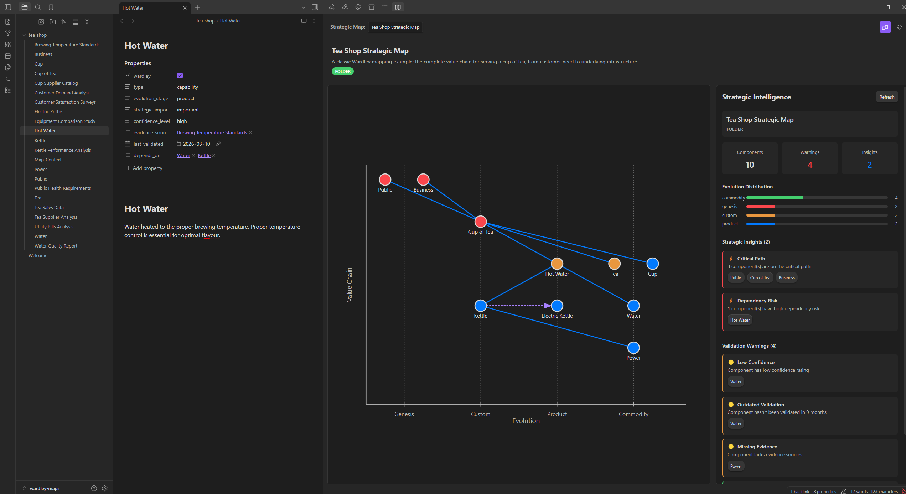

# Wardley Strategic Mapping

[](https://github.com/BlockSecCA/wardley-strategic/releases)
[](LICENSE)
[](src/)
[](https://obsidian.md)
[](test.mts)

An Obsidian plugin that builds interactive Wardley Maps from strategic YAML frontmatter across your vault notes.



## How it works

Each note in your vault is a strategic component. You add structured frontmatter to describe its evolution stage, importance, confidence, and relationships. The plugin scans your vault, builds a relationship graph, and renders an interactive Wardley Map with automatic layout.

### Define components

Add strategic frontmatter to any note:

```yaml
---
wardley: true
type: product
evolution_stage: product
strategic_importance: critical
confidence_level: high
evidence_sources:
  - "[[Customer Satisfaction Surveys]]"
last_validated: "2025-01-15"
depends_on:
  - "[[Cup]]"
  - "[[Tea]]"
  - "[[Hot Water]]"
---
```

### View the map

Run the command **Open Wardley Strategic Map** to see your components automatically positioned on a Wardley Map:

- **X-axis**: Evolution stage (Genesis, Custom, Product, Commodity)
- **Y-axis**: Value chain depth (user needs at top, infrastructure at bottom)
- **Colors**: Node color indicates strategic importance
- **Click**: Click any component to open its note

### Strategic Intelligence

Toggle the intelligence panel to see:

- **Validation warnings**: data quality checks on your notes
- **Strategic insights**: graph structure analysis
- **Distribution charts**: evolution stage and importance breakdowns

See [Strategic Intelligence](#strategic-intelligence) below for details.

## Frontmatter reference

### Component attributes

| Field | Values | Description |
|-------|--------|-------------|
| `wardley` | `true` | **Required.** Opts this note into strategic mapping |
| `type` | `component`, `user_need`, `capability`, `product`, `service` | Component classification |
| `evolution_stage` | `genesis`, `custom`, `product`, `commodity` | Position on evolution axis |
| `strategic_importance` | `critical`, `important`, `supporting`, `optional` | Drives node color |
| `confidence_level` | `high`, `medium`, `low` | Assessment confidence |
| `evidence_sources` | Array of `[[wikilinks]]` | Supporting evidence notes |
| `last_validated` | `YYYY-MM-DD` | Last review date |
| `strategic_maps` | Array of strings | Map membership IDs |

### Relationship fields

| Field | Direction | Description |
|-------|-----------|-------------|
| `depends_on` | Source depends on target | Value chain dependency |
| `enables` | Source enables target | Reverse dependency |
| `evolves_to` | Source evolves into target | Evolution arrow |
| `evolved_from` | Source evolved from target | Reverse evolution |
| `constrains` | Source constrains target | Constraint relationship |

All relationship values are arrays of `[[wikilinks]]` pointing to other notes.

## Map contexts

The plugin supports three scoping patterns:

1. **Vault-wide**: All strategic notes appear on one map (default)
2. **Folder-scoped**: Add a `Map-Context.md` file to a folder. Its first heading becomes the map name.
3. **Membership-based**: Add `strategic_maps: ["map-id"]` to notes to group them into named maps.

## Strategic Intelligence

The intelligence panel runs two types of checks against your map. These are simple, opinionated heuristics for a first-pass audit, not deep strategic analysis.

### Validation warnings

Data quality checks on individual notes:

| Warning | Triggers when | Severity |
|---------|--------------|----------|
| **Low Confidence** | `confidence_level` is `low` | medium |
| **Missing Evidence** | No `evidence_sources`, or linked evidence notes don't exist in the vault | medium/low |
| **Outdated Validation** | `last_validated` is over 6 months ago (medium) or 12 months (high), or missing entirely | low-high |
| **Evolution Inconsistency** | Type/stage combination is unusual (e.g., a `user_need` at `commodity` stage) | low |

The evolution consistency check uses a simple lookup of typical stage ranges per type:

| Type | Expected stages |
|------|----------------|
| `user_need` | genesis, custom |
| `capability` | custom, product |
| `component` | product, commodity |
| `service` | product, commodity |
| `product` | custom, product |

Components outside these ranges get a low-severity flag. It's a heuristic, not a rule.

### Strategic insights

Graph structure analysis across the map:

| Insight | What it detects | Priority |
|---------|----------------|----------|
| **Orphaned Components** | Notes with `wardley: true` that have no `depends_on`, `enables`, or other relationship edges. Disconnected from the value chain. | medium |
| **Critical Path** | Components marked `critical` importance, or components that 3+ other components depend on. Single points of failure. | high |
| **Evolution Gap** | A more-evolved component depends directly on a much less-evolved one (gap > 1 stage), suggesting missing intermediate layers. | medium |
| **Dependency Risk** | You depend on a component that has `low` confidence or hasn't been validated in over 12 months. Inherited uncertainty. | high |

## Installation

1. Copy `main.js`, `manifest.json`, and `styles.css` to your vault's `.obsidian/plugins/wardley-strategic/` directory
2. Enable the plugin in Obsidian Settings > Community Plugins

## Example vault

See the `examples/tea-shop/` directory for a complete example using the classic Tea Shop Wardley Map scenario.

## Development

```bash
npm install
npm run dev       # watch mode
npm run build     # production build
npm test          # run tests (48 tests)
```

## Credits

Layout algorithm and strategic analysis logic ported from [breadcrumbs_wardley](https://github.com/BlockSecCA/breadcrumbs_wardley), originally built on top of [SkepticMystic/breadcrumbs](https://github.com/SkepticMystic/breadcrumbs). Rewritten as a standalone plugin with no external dependencies.

## License

MIT
